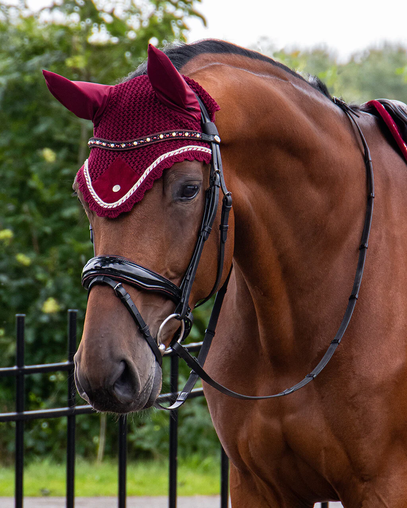

**Knurova Violetta**
> ## Contact Informattion 
+ _heremail@gmail.com_
+ +1 (222) 333-4455
+ very cool fr
## Cover Letter

>#### *Most recently, I worked as a Phone girl, where I gained extensive experience in customer service and effective communication. With my strong verbal communication skills and attention to detail, I was able to handle customer inquiries with ease while ensuring their satisfaction. Furthermore, my ability to multitask effectively in fast-paced environments helped me to manage multiple phone calls and tasks simultaneously while keeping deadlines. My experience as a Phone girl has prepared me in several ways for the demands of any job.Firstly, it has allowed me to hone my delegation skills, as I worked with other team members to ensure teamwork and the completion of tasks assigned promptly. Secondly, my observation skills will be a significant asset when analyzing new methods of efficient work. Lastly, my strong organizational skills have helped me to manage my work efficiently while paying attention to detail.My strengths in delegation, observation, and organization, align with your organization's requirement for a highly skilled and passionate professional. I am confident that I can bring a wealth of experience and abilities that will significantly contribute to your organization's growth.*

# Work Experience  
>## Be Well 
*Freshman, Sophomore, Junior, Senior: 8 hours/week, 52 weeks/year* \
I worked in “Be Well” medical supply store as a salesman, selling hygiene products for elderly patients. Sometimes Ima being moved inside the office to do inside office tasks, like picking up the phone and talk to the patients.
>## Launch boat driver
*Junior, Senior: 9 hours/week, 28 weeks/year* \
I am a launch driver at HRCS ( Hudson River Community Sailing Academy ) My job includes transporting people from the deck to the sail boats and picking them up from the boats. Also my tasks at the boat house are to open or close the boathouse, depending which shift I have. Cleaning and keeping the boathouse clean.
>## Office cleaner 
*Freshman, Sophomore, Junior, Senior: 6 hours/week, 25 weeks/year* \
I work as an office cleaner, once every try two weeks, at the same office I work as a customer service representative. My tasks include cleaning all of the surfaces, floors, restrooms.
>## Communication and Development Intern
*Junior, Senior: 4 hours/week, 52 weeks/year* \
I work at HRCS ( Hudson River Community Sailing ) Academy as a Communication and Development Intern in the boathouse office. My tasks include to manage the incoming donations to our boathouse and send out tax letter to the members that donated to our organization. I also receive photos from the sailors in our boathouse when they sail, and job is to sort the photos out and make sure that presentable photos go to our social medias. Additionally, on the events, I am supposed to represent HRCS and be the person who shares information about our organization, to people who don’t know about us.
>## Warby Parker Internship
*Junior, Senior: 4 hours/week, 52 weeks/year* \
I work at HRCS ( Hudson River Community Sailing ) Academy as a Communication and Development Intern in the boathouse office. My tasks include to manage the incoming donations to our boathouse and send out tax letter to the members that donated to our organization. I also receive photos from the sailors in our boathouse when they sail, and job is to sort the photos out and make sure that presentable photos go to our social medias. Additionally, on the events, I am supposed to represent HRCS and be the person who shares information about our organization, to people who don’t know about us.

# Education 
 >### 1) High School of Fashion Ind. Diploma(not even)
 >### 2) User Experience Google Certificate
 # Please Hire This Diva 

